# THE 999 BOX 🛍️

A full-stack MERN e-commerce platform with separate User and Admin authentication systems, a complete shopping and checkout flow, and a full-featured admin dashboard for managing products, orders, carts, users, and store settings.

[](https://react.dev/)
[](https://nodejs.org/)
[](https://expressjs.com/)
[](https://www.mongodb.com/)
[](https://redux-toolkit.js.org/)
[](https://stripe.com/)
[](https://www.paypal.com/)
[](./LICENSE)

**Live demo:** [999-box-mern-stack.vercel.app](https://999-box-mern-stack.vercel.app)
**Repo:** [github.com/Rameen-zahra2004/999-box-mern-stack](https://github.com/Rameen-zahra2004/999-box-mern-stack)

---

## 📑 Table of Contents

- [Features](#-features)
- [Screenshots](#-screenshots)
- [Architecture Highlights](#architecture-highlights)
- [Tech Stack](#️-tech-stack)
- [Project Structure](#-project-structure)
- [Getting Started](#-getting-started)
- [Security Notes](#-security-notes)
- [Known Limitations](#-known-limitations)
- [Roadmap](#️-roadmap)
- [Author](#-author)

---

## ✨ Features

### Storefront (User side)
- Browse products by category with search and filtering
- Product detail pages with image galleries and stock status
- Shopping cart with real-time quantity and total updates
- Checkout with **Stripe** and **PayPal** integration
- Order history and order detail views
- Order cancellation for pending orders
- Wishlist support
- User account settings and profile management

### Admin Dashboard
- Dashboard overview with live metrics (users, orders, revenue, products)
- Product management (create, update, delete, image upload/reorder)
- Order management with status updates
- Customer cart management (view, edit, clear any customer's cart)
- User management with role-based access
- Revenue analytics and reporting
- Activity log for admin actions
- Store-wide system settings
- Role and permission management
- Profile settings with password change and 2FA toggle

### Architecture highlights
- **Dual authentication system**: completely separate `User` and `Admin` MongoDB collections, each with its own namespaced HTTP-only cookies (`accessToken`/`refreshToken` for users, `adminAccessToken`/`adminRefreshToken` for admins) — both sessions can coexist in the same browser without colliding
- **Role-based access control** with `ADMIN` and `SUPER_ADMIN` tiers, enforced at the route layer on every admin-only endpoint
- **Token rotation with reuse detection** — refresh tokens are hashed and rotated on every use; a mismatch triggers a forced logout as a theft-response signal
- **Transactional order creation** — stock decrement, order creation, and cart clearing happen atomically via MongoDB sessions, so a failure partway through never leaves inconsistent data
- **Centralized, consistent error handling** — every error is normalized to a proper HTTP status code and shape before reaching the client, with full request context logged server-side via Winston

---

## 📸 Screenshots

### Storefront

| Homepage | Product Listing |
|---|---|
|  | 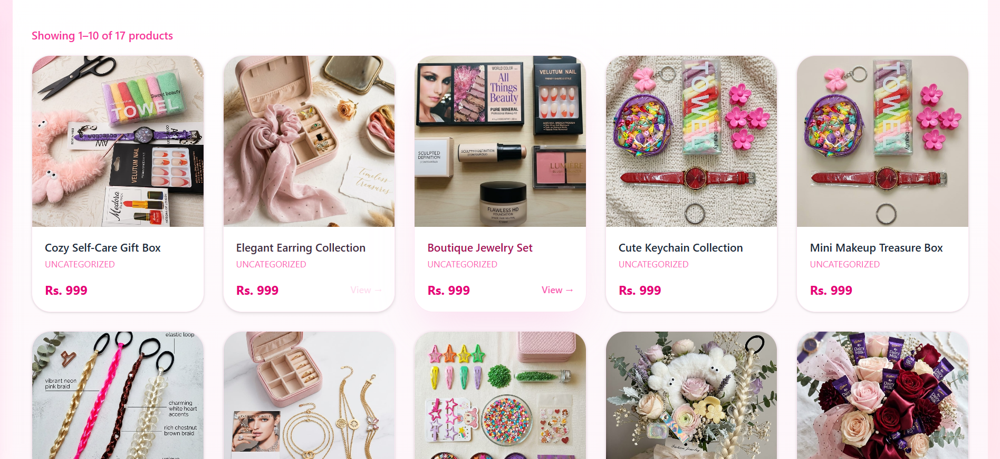 |

| Product Detail | Shopping Cart |
|---|---|
| 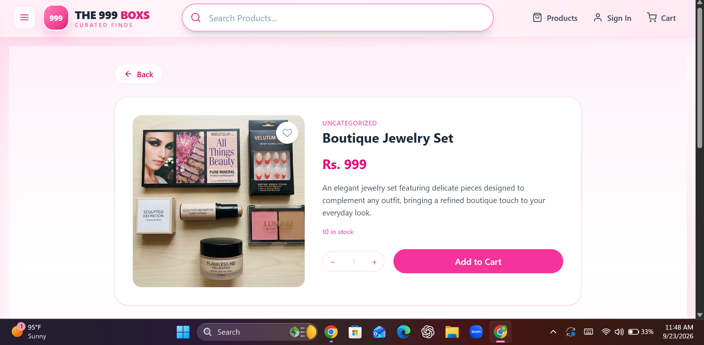 | 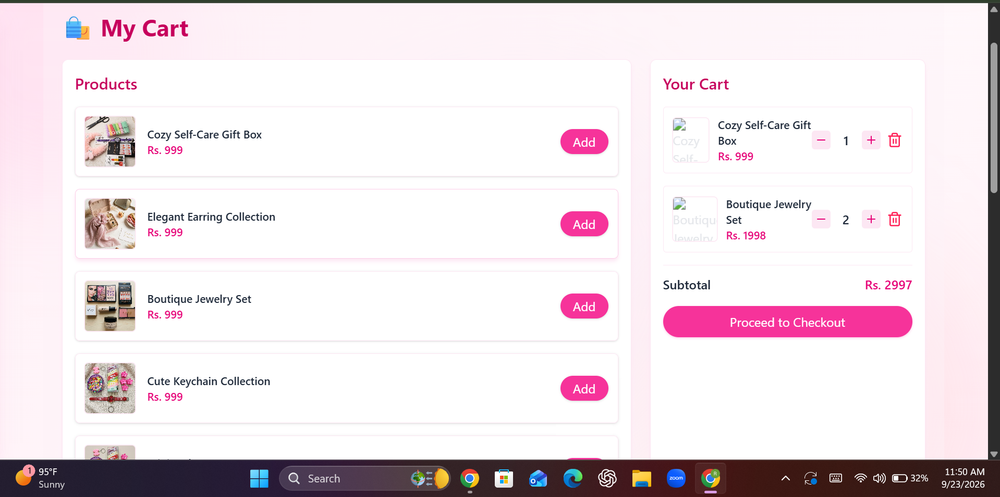 |

| Checkout | Login |
|---|---|
| 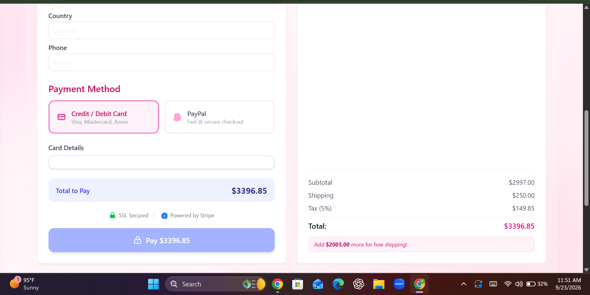 | 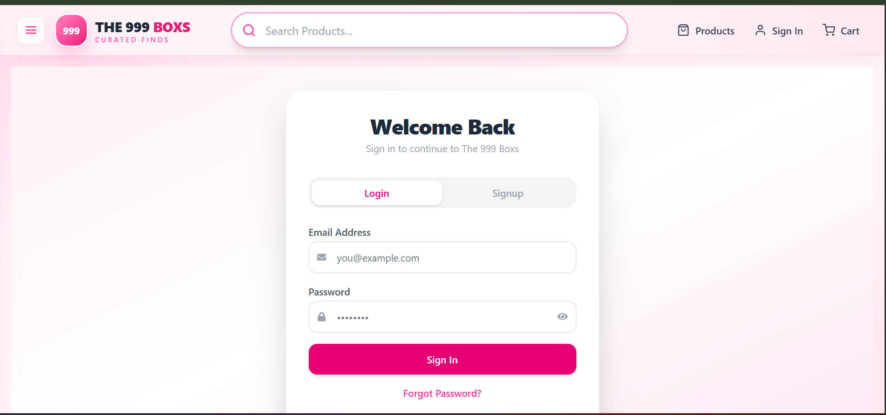 |

**User Dashboard**

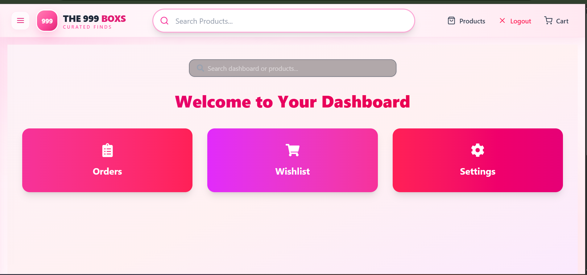

### Admin Dashboard

**Overview**

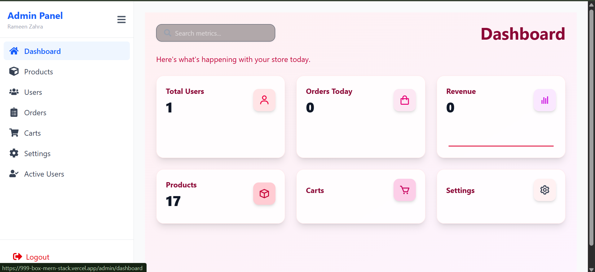

| Product Management | Order Management |
|---|---|
| 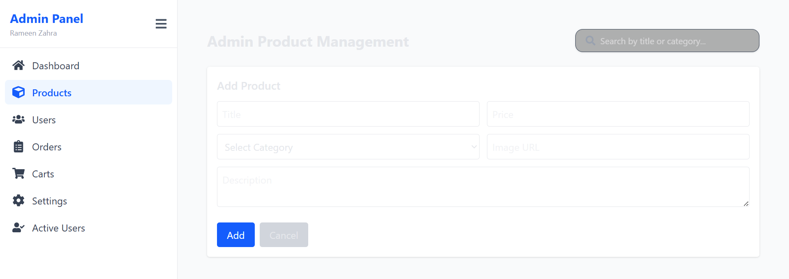 | 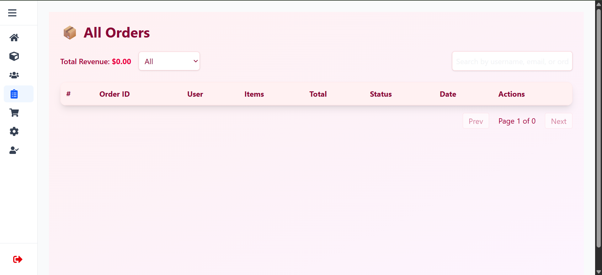 |

| User Management | Customer Carts |
|---|---|
| 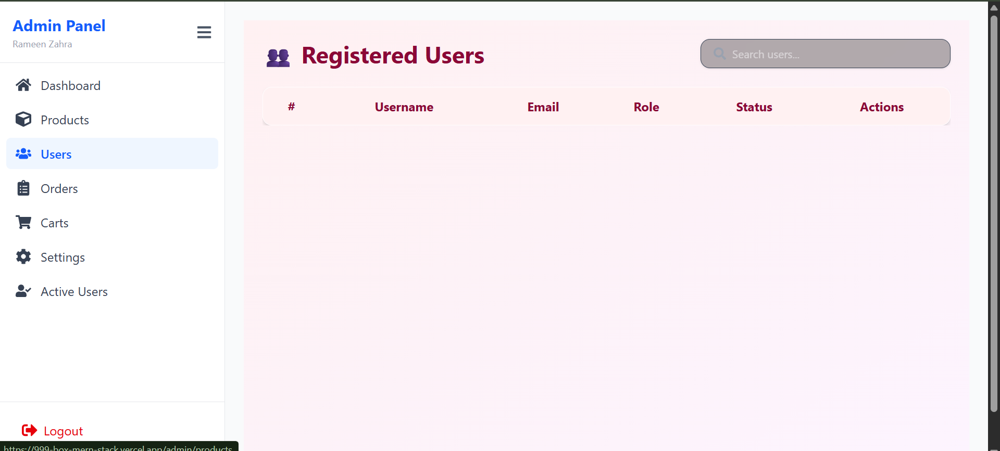 | 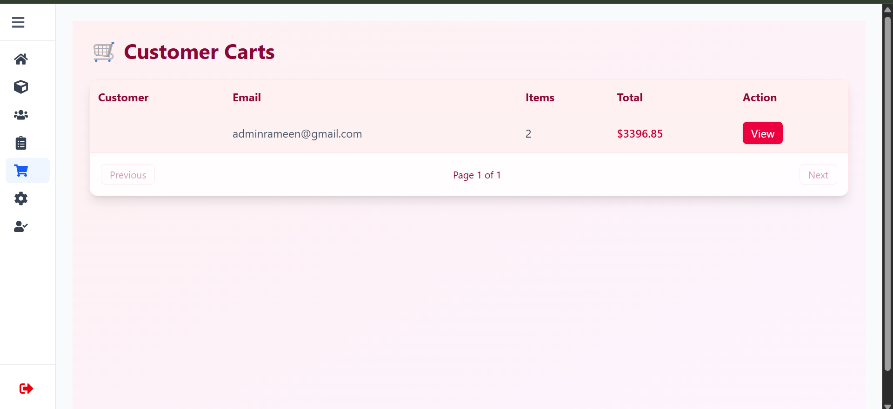 |

**Admin Settings**


---

## 🛠️ Tech Stack

**Frontend**
- React + Vite
- Redux Toolkit
- React Router
- Tailwind CSS
- Recharts (analytics charts)
- Stripe.js / PayPal SDK

**Backend**
- Node.js + Express
- MongoDB + Mongoose
- JWT authentication (access + refresh token pattern)
- bcrypt password hashing
- Joi request validation
- Multer for image uploads
- Winston for logging
- Helmet, express-rate-limit, express-mongo-sanitize for security hardening

**Payments**
- Stripe
- PayPal

---

## 📁 Project Structure

```
├── backend/
│   ├── modules/              # Feature modules (auth, admin, orders, cart, product, etc.)
│   │   └── <feature>/
│   │       ├── <feature>.routes.js
│   │       ├── <feature>.controller.js
│   │       ├── <feature>.service.js
│   │       ├── <feature>.model.js
│   │       └── <feature>.validation.js
│   ├── middleware/            # Global error handling, rate limiting, uploads
│   ├── config/                # DB connection, CORS, environment config
│   ├── routes/                # Central route aggregator
│   ├── app.js                 # Express app configuration
│   └── server.js               # Entry point — DB connection + server lifecycle
│
└── src/                        # Frontend (React)
    ├── Admin/                  # Admin pages (Dashboard, Products, Orders, Users, Carts, Settings)
    ├── Admin component/        # Shared admin UI components
    ├── AdminSettinngComponent/ # Settings sub-panels (Profile, Security, Roles, System)
    ├── AdminSlices/             # Admin-side Redux slices
    ├── Component/               # Shared components (Checkout, Header, Footer)
    ├── Pages/                    # User-facing pages
    ├── Slices/                    # User-side Redux slices
    └── Store/                      # Redux store configuration
```

---

## 🚀 Getting Started

### Prerequisites
- Node.js (v18+)
- MongoDB Atlas account (or local MongoDB instance)
- Stripe and/or PayPal developer accounts (for payment testing)

### Installation

1. **Clone the repository**
   ```bash
   git clone https://github.com/Rameen-zahra2004/999-box-mern-stack.git
   cd 999-box-mern-stack
   ```

2. **Backend setup**
   ```bash
   cd backend
   npm install
   ```

   Create a `.env` file in `backend/` with the following variables:
   ```env
   NODE_ENV=development
   PORT=5000
   CLIENT_URL=http://localhost:5173

   MONGO_URI=your_mongodb_connection_string

   JWT_ACCESS_SECRET=your_access_secret
   JWT_REFRESH_SECRET=your_refresh_secret
   JWT_ACCESS_EXPIRES_IN=15m
   JWT_REFRESH_EXPIRES_IN=7d

   STRIPE_SECRET_KEY=your_stripe_secret_key
   STRIPE_WEBHOOK_SECRET=your_stripe_webhook_secret
   PAYPAL_CLIENT_ID=your_paypal_client_id
   PAYPAL_CLIENT_SECRET=your_paypal_client_secret

   SMTP_HOST=your_smtp_host
   SMTP_PORT=587
   SMTP_USER=your_smtp_user
   SMTP_PASS=your_smtp_password
   ```

   Start the backend:
   ```bash
   npm run dev
   ```

3. **Frontend setup**
   ```bash
   cd ..
   npm install
   ```

   Create a `.env` file in the project root:
   ```env
   VITE_STRIPE_PUBLISHABLE_KEY=your_stripe_publishable_key
   ```

   Start the frontend:
   ```bash
   npm run dev
   ```

4. **Create your first Super Admin**

   Use the included bootstrap script (run once, on an empty Admin collection):
   ```bash
   cd backend
   node scripts/createSuperAdmin.js
   ```

The app will be running at `http://localhost:5173` (storefront) and the admin panel at `http://localhost:5173/admin/login`.

---

## 🔐 Security Notes

- All admin routes are protected by role-aware middleware (`protectAdmin` + `authorizeRoles`) — verified end-to-end across every admin module
- Passwords are hashed with bcrypt; refresh tokens are hashed before storage and never stored in plaintext
- Rate limiting is applied globally and more strictly on auth endpoints
- MongoDB queries are sanitized against NoSQL injection
- Sensitive routes require re-authentication; account lockout is enforced after repeated failed login attempts

---

## 📌 Known Limitations

A few admin features currently have frontend UI without full backend support yet — flagged transparently rather than hidden:
- **Role management** (add/remove custom roles) — read-only for now
- **Security panel** (rate-limit/IP-block visibility) — backend routes not yet built
- **Data export / account deletion** — UI present, backend endpoints pending

---

## 🗺️ Roadmap

- [ ] Full role management CRUD
- [ ] Security dashboard backed by real rate-limit/IP-block data
- [ ] Data export (JSON/CSV) and account deletion flows
- [ ] Automated test coverage (Jest / Supertest)
- [ ] CI/CD pipeline

---

## 👤 Author

**Rameen Zahra**
Full Stack MERN Developer

- GitHub: [Rameen-zahra2004](https://github.com/Rameen-zahra2004)
- LinkedIn: [Rameen Zahra](https://www.linkedin.com/in/rameen-zahra-5a31a7381)

---

## 📄 License

**All Rights Reserved.** This code is publicly viewable for portfolio and educational purposes only — it is not licensed for reuse, redistribution, or modification. See [LICENSE](./LICENSE) for full terms. Contact the author for commercial use or collaboration inquiries.

---

## ⭐ Support

If you like this project, give it a ⭐ on GitHub.
